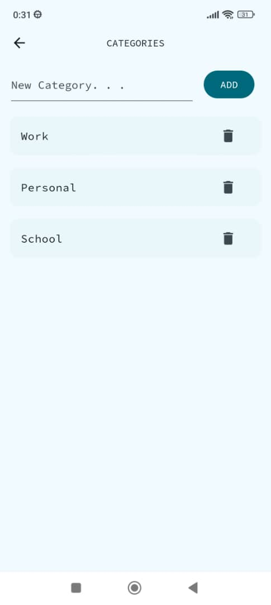
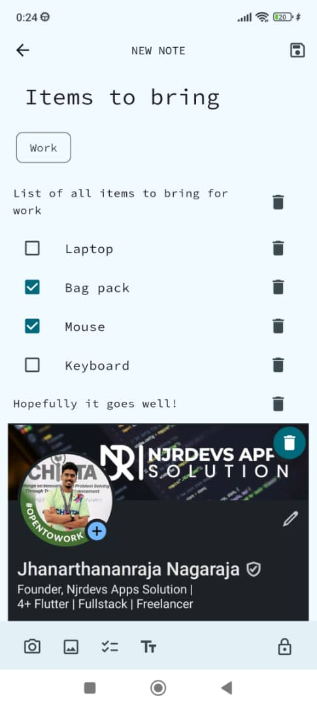
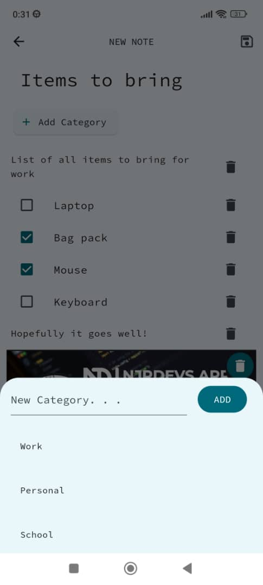
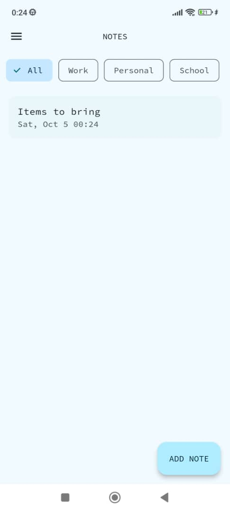
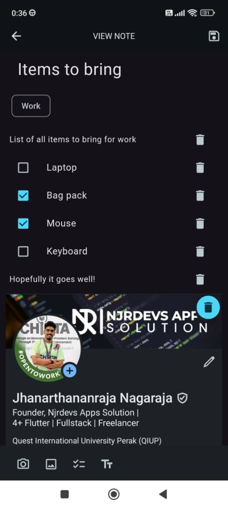
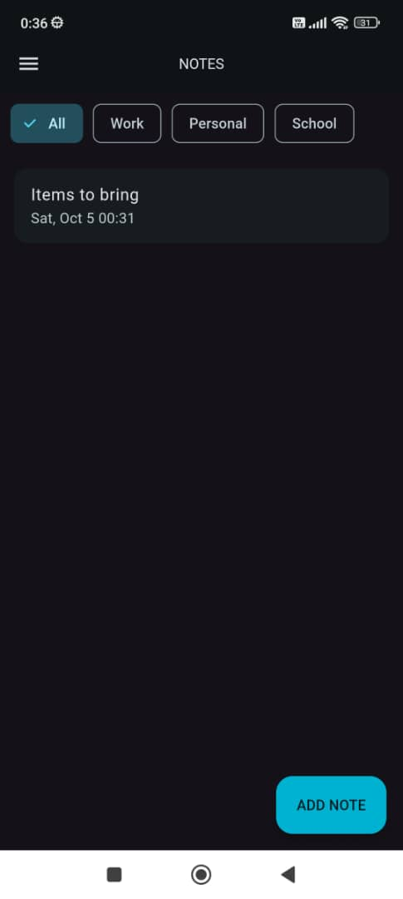

# Notes

<p align="center"> 
  
  </p>
A simple notes app built using Flutter, inspired by [Notes](https://github.com/ostoaleonardo/notes).

---

## Features

- **Add Notes**: Create new notes easily.
- **Add Category**: Organize your notes by adding custom categories.
- **Sort by Category**: View and manage notes based on their assigned categories.
- **Rich Content in Notes**: Add text, checklists, and images to your notes for detailed documentation.
- **Rearrange Any Items**: Easily reorder any items in your notes to follow your preference!
- **Locked Notes**: Protect sensitive notes with a lock for added privacy.
- **Dark Mode**: App Theme changes based on your settings.

---

## Getting Started

### Prerequisites

- [Flutter](https://flutter.dev/docs/get-started/install) (version 3.0 or above recommended)
- [Dart](https://dart.dev/get-dart)

### Installation

1. Clone this repository:

   ```bash
   git clone https://github.com/tacticalninj4/notes.git
   ```
2. Navigate to the project directory:

   ```bash
   cd notes
   ```
3. Install dependencies:

   ```bash
   flutter pub get
   ```
4. Run the app:

   ```bash
   flutter run
   ```

---

## Screenshots

<p align="center">
  
  
  
</p>
<p align="center">
  
  
  
</p>

---

## License

This project is licensed under the MIT License.

---

## Contact

For any inquiries or feedback, reach out at [jhanarthananraja@gmail.com](mailto:jhanarthananraja@gmail.com).

---

## Acknowledgements

- Inspired by [Notes](https://github.com/ostoaleonardo/notes).
